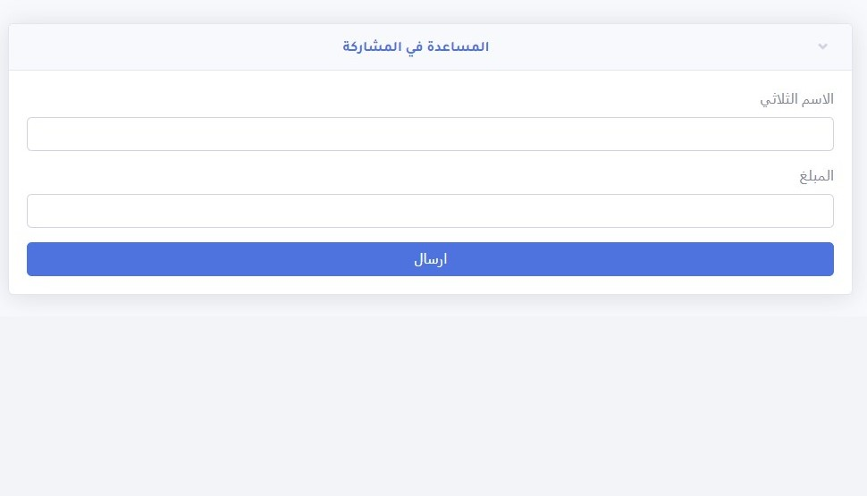
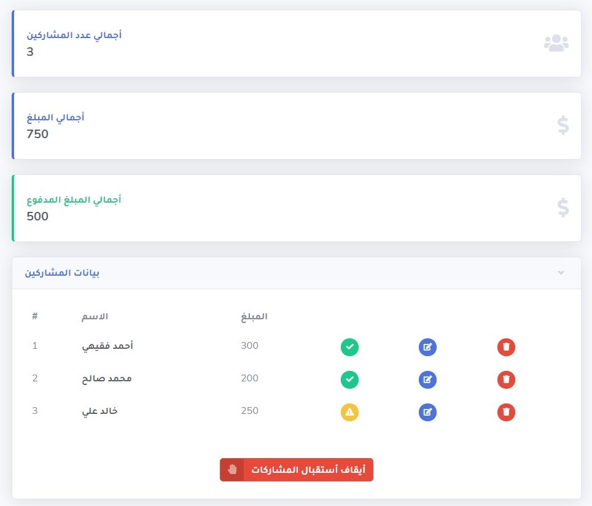

[![LinkedIn][linkedin-shield]][linkedin-url]
[![Twitter][twitter-shield]][twittwe-url]
[![Twitter][github-shield]][github-url]

<!-- PROJECT LOGO -->

  <h3 align="center">Donor Registration System  `[ Old Version ]` </h3>

  

    Is a small system for Donor registration get name and amount of the donor, has a dashboard showing how many people joined and how much money collect.
     
    <a href="https://projects.iahmad.info/DRS">View Demo</a>
  

<!-- TABLE OF CONTENTS -->

  
<h2 style="display: inline-block">Table of Contents</h2>

  <ol>
    <li>
      <a href="#build-with">Build With</a>
    </li>
    <li><a href="#usage">Screenshots</a></li>
    <li><a href="#contact">Contact</a></li>
  </ol>

**The aim of this project is a facilitate the access of students' excuses submitted to the lecturer in an electronic, easy, fast and uninterrupted way.**
 
<!-- Build With -->
## Build With
*  HTML & CSS
*  PHP Pure (OOP)
*  MySQL
*  Vanilla Javascript
*  Bootstrap 4

<!-- USAGE EXAMPLES -->
## Screenshots
First user most login to make order.

*  Form for insert name and how much money  

*  Form for insert name and how much money  

*  Dashboard  

<!-- CONTACT -->
## Contact

Ahmad Faqehi - [@A_F775](https://twitter.com/A_F775) - alfaqehi775@gmail.com

Project Link: [https://github.com/Ahmad-Faqehi/Donor-Registration-System](https://github.com/Ahmad-Faqehi/Donor-Registration-System)

<!-- MARKDOWN LINKS & IMAGES -->
<!-- https://www.markdownguide.org/basic-syntax/#reference-style-links -->
[linkedin-shield]: https://img.shields.io/badge/-LinkedIn-black.svg?style=for-the-badge&logo=linkedin&colorB=555
[linkedin-url]: https://linkedin.com/in/ahmad-faqehi
[twitter-shield]: https://img.shields.io/badge/-twitter-black.svg?style=for-the-badge&logo=twitter&colorB=555
[twittwe-url]: https://twitter.com/A_F775
[github-shield]: https://img.shields.io/badge/-github-black.svg?style=for-the-badge&logo=github&colorB=555
[github-url]: https://github.com/Ahmad-Faqehi
